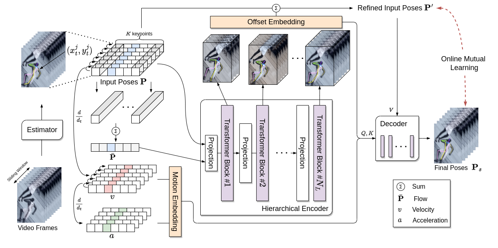
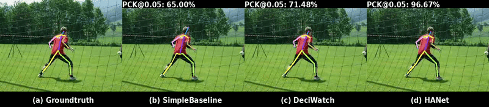
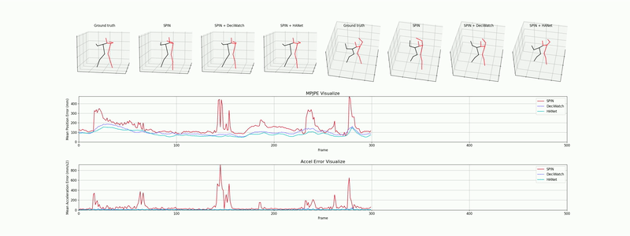
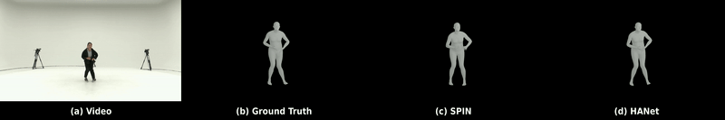

# HANet



## Contributions

- We propose a novel approach HANet that utilizes the keypoints’ kinematic features, following the laws of physics. Our method addresses temporal issues with these proposed features, effectively mitigates the jitter, and becomes robust to occlusion.

- We propose a hierarchical transformer encoder that incorporates multi-scale spatio-temporal attention. We use multi-scale feature maps, i.e., leverage all layers’ attention maps, and improve performance on benchmarks that provide sparse supervision.

- We propose online mutual learning that enables joint optimization between refined input poses and final poses, which chooses an online learning target by their training losses.

- We conduct extensive experiments on large datasets and demonstrate that our framework improves performance on tasks: 2D pose estimation, 3D pose estimation, body mesh recovery, and sparsely-annotated multi-human 2D pose estimation.

## Getting Started

### Environment Requirement

Clone the repo:

```bash
git clone https://github.com/wacv1686/HANet.git
```

Install the HANet requirements using `conda`:

```bash
# conda
conda create env --name HANet python=3.6
conda activate HANet
pip install -r requirements.txt
```

### Prepare Data

We prepare all the datasets as soon as possible. Sub-JHMDB data used in our experiment can be downloaded here.

[Google Drive](https://drive.google.com/drive/folders/1uLpuRcRbbVqmyndCnuuaW7qRACJaqMX1?usp=sharing)

| Dataset                                  | Pose Estimator                                                               | 3D Pose | 2D Pose | SMPL |
| ---------------------------------------- | ---------------------------------------------------------------------------- | ------- | ------- | ---- |
| [Sub-JHMDB](http://jhmdb.is.tue.mpg.de/) | [SimpleBaseline](https://github.com/microsoft/human-pose-estimation.pytorch) |         | ✔       |      |

### Training

Note that datasets should be downloaded and prepared before training.

Run the commands below to start training on Sub-JHMDB:

```shell script
python train.py --cfg configs/config_jhmdb_simplebaseline_2D.yaml --dataset_name jhmdb --estimator simplebaseline --body_representation 2D
```

### Evaluation

**Results on 2D Pose:**

| Dataset   | Estimator      | PCK 0.05 (Input/Output):arrow_up: | PCK 0.1 (Input/Output):arrow_up: | PCK 0.2 (Input/Output):arrow_up: | Checkpoint                                                                                           |
| --------- | -------------- | --------------------------------- | -------------------------------- | -------------------------------- | ---------------------------------------------------------------------------------------------------- |
| Sub-JHMDB | simplebaseline | 57.3%/88.7%                       | 81.6%/97.5%                      | 93.9%/99.5%                      | [Google Drive](https://drive.google.com/drive/folders/11A5NFkViDgQNyCGGwsmhAbUkwmV36M-E?usp=sharing) |

## Visualization

We prepare all visualization codes as soon as possible.

### 2D Pose

Visualize comparison on Sub-JHMDB



### 3D Pose

Visualize comparison on AIST++



### 3D Body Mesh Recovery

Visualize comparison on 3DPW


Visualize comparison on AIST++


